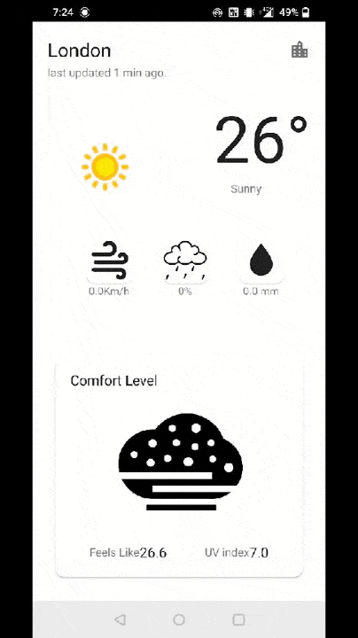
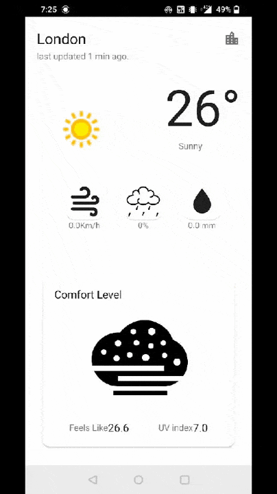

# Quick-Weather-App

Quick weather app to show weather of current or specified location with 3 days of update.

It is written 100% in Kotlin 🙂

## Languages, libraries and tools used

* [Kotlin](https://kotlinlang.org/)
* Android Support Libraries
* [Coroutine](https://kotlinlang.org/docs/reference/coroutines-overview.html)
* [Room](https://developer.android.com/training/data-storage/room)
* [Hilt](https://developer.android.com/training/dependency-injection/hilt-android)
* [Glide](https://github.com/bumptech/glide)
* [Retrofit](https://github.com/square/retrofit)

## Weather Api
* [Weather api](https://www.weatherapi.com/)

## Requirements

* JDK 1.8
* [Android SDK](https://developer.android.com/studio/index.html)
* Latest Android SDK Tools and build tools.

## Installation

* To run this code, clone this repository using this command `git clone https://github.com/manish-jandu/B-Contacts.git`
* Import into android studio
* Build the project and run on an android device or emulator

## Demo
 - video - [youtube](https://www.youtube.com/watch?v=PRFYkvzj68A)
 - Drive - [Apk](https://drive.google.com/drive/folders/18BaoM2eH99Tu3WJp6uaiYGaB7loVeLX7?usp=sharing)

## Screens

 

  
  
 

